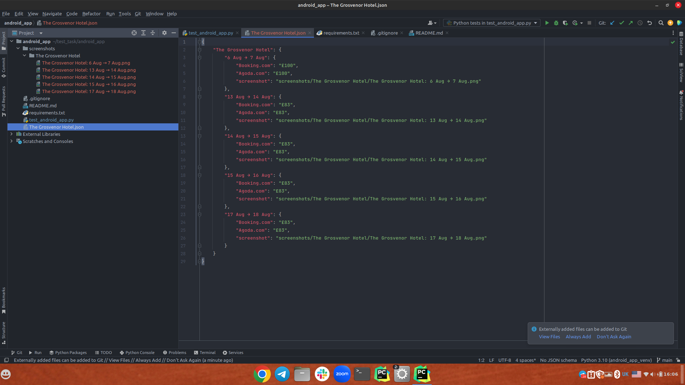
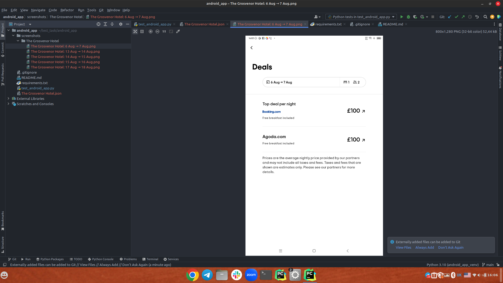

The test case first opens the app and skips the initial screens. Then, it searches for the hotel "The Grosvenor Hotel" and extracts the deals for the hotel. Finally, the test case saves the deals to a file.

Here is a brief explanation of what each function in the code does:

1. write_to_file() takes a dictionary of deals and a hotel name as input, and saves the dictionary to a file.
2. test_skip_initial_screens() tests that the app is able to skip the initial screens.
3. test_search_hotel_and_extract_deals() tests that the app is able to search for a hotel and extract the deals for the hotel.
4. write_all_deals() takes a list of proposals and a hotel name as input, and extracts the deals from the proposals.
5. process_days() takes a list of days as input, and iterates through the days to extract the deals for each day.

## 1. JSON file:

## 2. screenshots:

